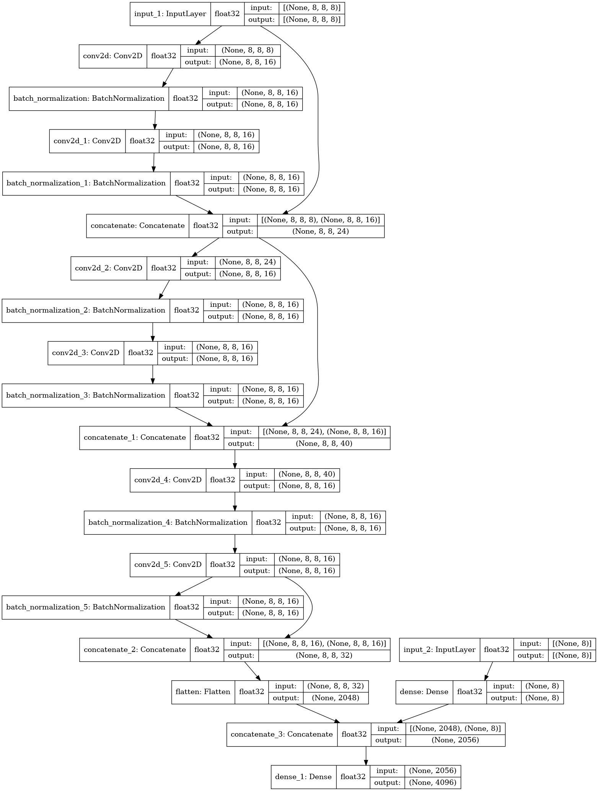

# chess_cnn_supervised

## Introduction

TLDR: Train a chess CNN on collection of PGN games

<br>

An implementation of a Chess CNN trained on a collection of PGN games:

to use, run `python main.py; python kivy_gui.py `


for example: `python main.py --epochs=10 --rating=2500 --download_url="https://database.nikonoel.fr/lichess_elite_2020-09.zip"; python kivy_gui.py`

Full options of `main.py` (running `python main.py --help`) are :
```
NAME
    main.py - The complete pipeline of downloading PGN Zip from Lichess (https://database.nikonoel.fr), Training a CNN using Keras (https://keras.io) and then Playing the Engine using Kivy (https://kivy.org).

SYNOPSIS
    main.py <flags>

DESCRIPTION
    Note: Currently need to run "python kivy_gui.py" after this command, as Tensorflow doesn't release the GPU memory
    after training. Likely a bug.

FLAGS
    --download_url=DOWNLOAD_URL
        Type: str
        Defa...
        Path to Lichess PGN Zip, E.g. https://database.nikonoel.fr/lichess_elite_2021-01.zip". Otherwise can modify the download_pgn function yourself
    --rating=RATING
        Type: int
        Default: 2600
        Rating threshold for games to be trained on
    --model_name=MODEL_NAME
        Type: str
        Default: 'chess_model.h5'
        Model save name
    --epochs=EPOCHS
        Type: int
        Default: 20
        Number of epochs to train the Chess CNN on

```


(The `; python kivy_gui.py` is needed because Tensorflow has a bug in which it doesn't release GPU memory after training causing an OOM error when loading the GUI, so have to kill the process and then run the GUI.)

## Method

I heavily rely on [python-chess](https://github.com/niklasf/python-chess) for handling the chess logic. I used Numpy and Tensorflow to convert the Chess board state into a Tensor:
  - 8x8 for the spatial information on the board, one for each row and column.
  - Another 7 for the information on each square, e.g. (colour of the piece, is it a pawn, is it a knight...). I repeat the colour of the piece in the last position, leading to another 8 array.
  - Lastly, I encode the overall state with another array of size 8, (whose turn it is, castling rights), I ignore En passant and add 3 values to pad to size 8.

Thus, I have an array of 8x8x8 for the board and 8 for the overall state as inputs.

The output is a one-hot array of size 4096 (64*64). This is every combination of square to move from to square to move to on the board. 

The model itself is very variable, one example of the layout:



## Results 

The results vary a lot depending on the exact model architecture and amount of training data. But for >20,000 games or more I found an accuracy of around `40%`, using a learning rate of 0.001-0.0001 for 20-30 epochs.

This may not seem like much, but considering the number of potential outputs, i.e. choosing from 4096 moves, it is very good. 

When applying constrains like choosing out of legal moves, this rises to `>70%`. 

A few drawbacks:

- I found it didn't always capture pieces and would sometimes make silly mistakes like sacrificing a queen for no reason. To counter this, I add a min-max algorithm at a depth of 2-3.
- The model accuracy is limited by the quantity of training data. Unlike, reinforcement learning or self play, which has the potential for infinite data. Although, this is not a particular problem for Chess.
